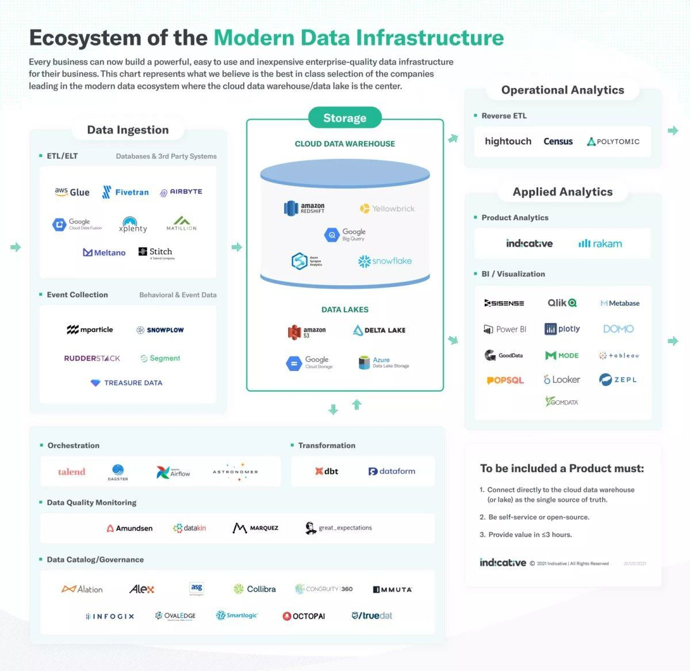
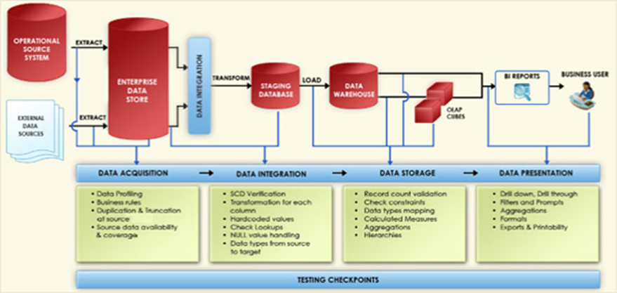
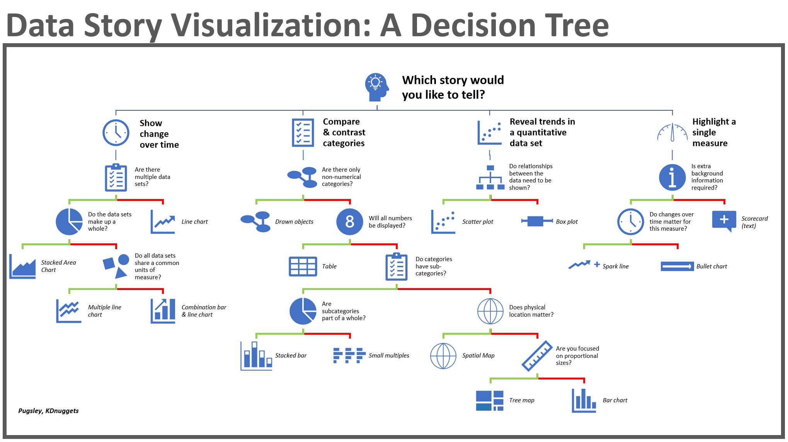

# Project Management Tips & Tricks

Some Tips and Tricks about Project Management.

     

## Useful documents

* General technical specifications
* Detailed technical specifications
* General functional specifications
* Detailed functional specifications
* Code review check list
* ETL project plan
* Code review check list
* The different laws of life
* Data Integration Master Test Plan
* Propose a [data dictionary](./resources/data_dictionary.xltx)
* Propose a [data mapping](./resources/data_mapping.xltx)
* Estimate the [development costs of a project](./resources/cost_estimate.xltx)
* Build a [test requirement hierarchy](./resources/test_requirement_hierarchy.xltm)
* Build an [internal test grid](./resources/internal_test_grid.xltx)
* Build a [generic test grid](./resources/generic_test_grid.xltx)
* Play with a [Gantt chart](./resources/gantt_chart.xltx) and Excel ;)

## Useful links

* [A code review checklist prevents stupid mistakes](https://dev.to/bosepchuk/a-code-review-checklist-prevents-stupid-mistakes-o6)
* [Master Test Plan](https://dzone.com/articles/part-3-how-to-develop-a-data-integration-master-te)
* [Delf](http://www.delf.fr/) - Some technical sheets
* [Agile Project Management](https://gestiondeprojets.wordpress.com/) - A blog about agile project management

## Useful tools

* [Mockaroo](https://www.mockaroo.com/) - A realistic data generator
* [Isoflow](https://isoflow.io/) - An online network diagram editor
* [Docusaurus](https://docusaurus.io/en/) - Makes it easy to maintain Open Source documentation websites
* [SequenceDiagram](https://sequencediagram.org/) - An online sequence diagram editor
* [DbDiagram](https://dbdiagram.io/d) - Make some diagrams from your DB (MySQL, PostgreSQL, Rails, SQL Server) and export them to PDF, PNG or an another RDBMS

## Tomorrow I will learn about

* [DbFit](http://dbfit.github.io/dbfit/) - Test-driven database development

## Build with

* [Git](https://git-scm.com) - Open source distributed version control system

## Contributing

If you would like to contribute, read the CONTRIBUTING.md file to learn how to do so.
