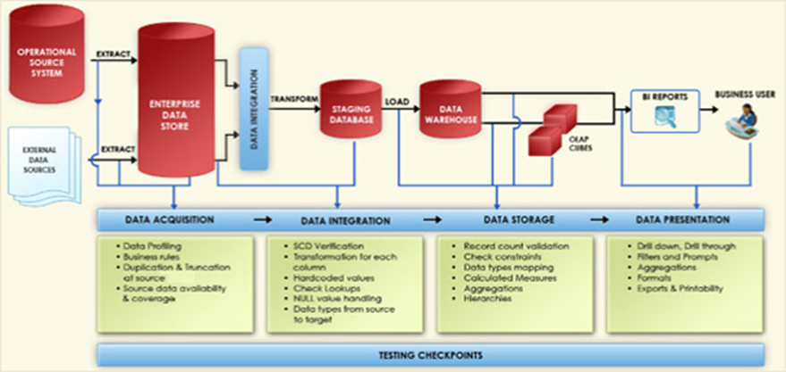

# Data Integration Master Test Plan

## Introduction

This Master Test Plan describes the appropriate strategies, process, methodologies used to plan, organize, execute and manage testing of the Data Platform implementation to include the data warehouse and BI reports.

### Intended Audience

* Project managers
* Product managers
* Developers
* Business and Technical subject matter experts (SME’s)
* Business analysts
* Data analysts and DBA’s

### Testing Objectives and Scope

#### Test Objectives Strategy

The general objective for DW/BI testing is to validate and verify each process of the BI project and ensure that they are supported by existing business processes and rules. Specific testing tasks to achieve this objective are stated below. 

The general scope of ETL test contractor work for the Abc project includes planning, execution, implementation, of the new business intelligence application: 
1. Independently validate information upstream, downstream, and within ETL 
2. Detect source errors and prevent them from propagating to targets 
3. Minimize the risk of the data loss during development and test 
4. Assure data accuracy and data quality with a focus on target data   
5. Ensure that all data represented by data maps and process plows are deployed successfully 
6. Ensure successful loads of source data into each destination repository 
7. Ensure that all data validations have been performed 
8. Ensure that all the Lookup checks have been accomplished 
9. Pre-screening tests: Verify for missing values, duplicates, data formats etc. 
10. Completeness tests: Enable count comparisons between all sources and associated targets 
11. Uniqueness tests: Verify for the uniqueness constraint defined data requirements 
12. Referential integrity tests: Verify that complete records have been copied and that technical as well as logical integrity is maintained 
13. Reconciliation tests: perform complete source-to-target comparisons including file-to-database and database-to file comparisons 
14. Define the test approach/strategy as described in the project Master Test Plan (MTP)
15. Develop detailed test plans that describe the appropriate test coverage, and ensure each release is sufficiently tested prior to production 
16. Develop automation strategy and identify tools (ex., Katalon) for testing that requires minimal maintenance 
17. Create a set of test data. Management of this data should be controlled by a tool and automated. 
18. Identify the test environments that will be needed to sufficiently test the DW and BI application.  
19. Prepare/identify and execute test cases in accordance with the approved Test Plans. Document actual test results as part of the test execution activities. Obtain approval for each test that is executed successfully.  
20. Provide developers with quick feedback. This can be accomplished by including automation in the CI process. 
21. Identify the process(es) that will be used to document, track, report and manage issues that are identified during the testing activities.  
22. Establish a repository of test cases to be used as a benchmark for future releases.  
23. Achieve an acceptable level of risk that balances cost of testing against the cost and likelihood of potential failures.  

#### In Scope – Data Platform Planning 

The following areas of application testing are considered in scope for the Data Platform server test plan :
* Data validation testing (sources, targets, internal data movement including cleansing, aggregations and other forms of transformations)
* Business rules testing
* Performance/load testing
* Regression testing

#### In Scope – Data Platform Testing 

The following areas of application testing are considered in scope for the Dashboard Designer test plan :
* Data validation testing for all incoming source data
* Presentation layer testing (dashboards, scorecards, reports, KPI, security)
* Metric Calculation Validation
* Performance Testing
* Regression Testing

#### Out of Scope

The following areas of application testing are considered out of scope and will not be included in this test plan :
* Unit  Testing (developer’s responsibility)
* User acceptance testing
* Testing systems external to data platform server

## Roles and Responsibilities

The following table describes the roles that will be required for successful execution of all tests :

| Role | Responsibilities |
| ---- | ---------------- |
|Functional Testers|Design functional test cases; execute all functional tests; write SQL and build pivot table comparisons for data tests; write defect reports and deliver status to test lead. Test execution (data, uar/uat, performance). Responsible for providing access to qa tools, templates and pre-requisites for testing |
|Performance Tester|Define performance test plan; create automated load scripts, execute load tests; monitor test environment; compile performance test results; write defect reports; and deliver status to test lead.|
|Etl support|An extract/transform/load (etl) subject matter expert, familiar with all of the business rules surrounding data movement that can answer any questions for the test effort.|
|Modeler support|A modeler subject matter expert, familiar with all of the business rules surrounding the form and application design that can answer any questions for the test effort.|
|OLAP support|A developer familiar with the implementation and business rules implemented in the cube environment|
|Dashboard support|A dashboard developer or solution architect familiar with the implementation of the scorecards, report, and dashboard components.|
|Test environment support|A support contact for infrastructure issues related to the test environment.|
|Test Lead|Review use cases, hld, wire frames & nfrs Create test strategy & master test plans Validate test cases to ensure that they are detailed and coverage is optimum Validate test execution logs and defect report logs Validate the data in the database Complete support of user acceptance testing Complete test plan and deliver test results; ensure test schedules are met; track all defect reports and their resolutions; deliver test status reports; and serve as an escalation point for all tests. Master test strategy & plan (describing the test strategy, scope, entry & exit criteria) Test coverage matrix (traceability matrix) System & integration test cases (manual) Test execution reports Defect reports Test execution in QA (functional, regression, integration, and system testing) Status reporting Test metrics preparing|

## QA Entry, Exit Criteria

### QA Entry Criteria

The following entry criteria should be met before QA testing for each sprint. 

1. Build deliverables (databases, scripts, etc.) are available as per the project plan.
2. Planned unit testing is complete, open issues are documented, none are critical or severe..
3. Severity 1 and 2 defects from previous QA cycle are fixed, delivered, tested and closed 
4. A stable test environment is ready for testing. 
5. Test cases are ready and covers all the functionalities for the sprint. 
6. Tester ID’s and access rights have been created in the test environment 
7. Appropriate access rights are set up in the TestTrack for testers/managers. 
8. Code delivery to QA for the sprint is accompanied by documentation indicating areas of functionality that are available. 
9. Data track release notes have been delivered and no critical ETL or DB issues are open 
10. All QA environment schema are set up according to the test plan for current build/iteration 
11. ETL code migrated from development environment into QA environment 
12. QA was provided all access to DB and ETL code in QA region of one week before QA start date 
13. Developers finished ETL sanity check successfully in QA region one day before QA start date
14. Smoke/sanity testing were successful 

### QA Exit Criteria 

1. All defects are either closed or deferred and test cases related to deferred defects should be mapped to defect ids and remains failed 
2. Product owner should agree to sign off on all open defects as tolerable for product launch. 
3. A test plan with execution report should be published after release and should be reviewed by concerned stakeholders 
4. All test cases that are critical or high should be fixed and pass tests 
5. 80% or more of build functionality can be tested 
6. Platform performance is such that test team can productively work to schedule 

### Suspension / Resumption Criteria

Testing will be suspended and resumed according to the following conditions:

| Suspension Criteria | Resumption Criteria |
| ------------------- | ------------------- |
|All test cases have been run as close to completion as possible and are awaiting defect fixes for retest|Testing will resume once the development team has resolved the defect and assigned it back to the test team|
|Testing is not possible due to a failure of a system or deliverable spelled out as a dependency in the test plan or cases|Testing will resume once the appropriate support team closes the issue raised by the test team|
|Critical scope changes occur which require a revision of the test plan and/or cases which will require approval from test stakeholders|Testing will resume once all scope changes have been built into the test plan and cases, and the modifications to the test plan and cases have been reviewed and approved by all test stakeholders|

## Assumptions for Test Execution

The following assumptions are made with respect to the test effort in writing this plan:

* A separate test environment will be supplied and populated for the test efforts that meet the following requirements:
1. The environment that can run all application functionality 
2. The performance test environment must be production-like in terms of load capacity (# of servers, speed of processors, amount of memory, etc.)
3. All test environments must be available and isolated from other use for the tests to be run without interference from ongoing development work
* Business Rules with respect to data movement, security, forms design, and performance are defined, signed off and accessible to the test team
* The test team is granted the role of Global Administrator in the Data Platform server application in the test environment
* The test team is granted the role of administrator on all test environment servers
* The test team is granted all required access to source data systems, and outbound data streams
* Artificial user accounts must be set up within the network and the Data Platform server application to facilitate artificial user load during the performance tests
* At the minimum, one key business subject matter expert per business domain will be available within 24 hours of the request.
* All environments (sourcing, staging, and target) are documented (conceptual/logical data models, physical data model, business rules, and interfaces), available, and accessible by the data integration team as scheduled.
* A comprehensive and up-to-date data dictionary of the legacy data is available.
* A final set of relevant business rules will be made available to the QA team prior to the currently scheduled test start date of the data integration build phase.
* Data obfuscation is not within the scope of the data integration team’s responsibilities.

## Test Methodology

### Test Planning and Execution

Test Planning will be conducted during sprints and prior to each sprint as well. During Test Planning, test conditions, test data, test cases and expected results will be documented. Planning for User Acceptance Testing (UAT) and Initial Deployment (Pilot) Testing also includes defining acceptance criteria, which are the rules used to determine when the work has been successfully completed. 

For Test Planning, the following table documents the roles primarily involved in planning, the major activities, and the work products for each type of test. 

|Test Type|Responsibility|Major Activities|Work Products|
|---------|--------------|----------------|-------------|
|Unit|Developer|Construct unit test cases Identify data requirements Conduct unit testing of module|Unit test cases with expected and actual results|
|String Component|Developer|Construct string test cases Identify data requirements Conduct string testing of modules|String test cases with expected and actual results|
|Smoke and Functional|Business Users(s) Testing Engineer External Entity Rep|Identify test cases|Identify/validate data requirements Determine timing of test cases Execute test cases|Smoke test cases and actual results for basic health check of builds during beginning of sprints Functional test cases for each functionality/tasks derived from user stories and actual results Business User/Product owner sign off|
|System Integration|Business User(s) Testing Engineer Developer/Fixer External Entity Rep|Identify test cases Identify/validate data requirements Determine timing of test cases Execute test cases|Over all system-integration test cases System-Integration test cases with expected and actual results Business User/Product owner sign off|
|Regression|Testing Engineer Configuration Manager|Compare results before and after a module or configuration change|Result comparisons Testing Lead/Manager Sign off
|Performance/Volume|Performance Engineer|Develop Performance/Volume Test Plan Execute Performance/Volume Test|Performance/Volume Test Plan Performance/Volume Test Results Performance Mgr. Sign-Off|
|User Acceptance Testing|Business User(s) Testing Engineer Developer/Fixer External Entity Rep|Identify acceptance test cases Identify/validate data requirements Determine timing of test cases Execute test cases|UAT results Business User/Product owner sign off|
|Initial Deployment (Pilot)|Business User(s) Testing Engineer Developer/Fixer External Entity Rep|Identify test scenarios Identify/validate data requirements Determine timing of test cases Execute test cases|Initial Deployment (Pilot) results Business User/Product owner sign off|

### General Categories of DWH Testing

The diagram below the data entry points and lists a few sample checks at each stage of the project.

The scope of testing for each release in the program comprises the following types of testing : 
1. Unit Testing (as part of the development work) - tests a logical unit/component of work (LUW) such as a component, data access object (DAO) or a screen (GUI). 
2. String/Component Integration Testing (as part of the development work) - tests the integration of logical groups of unit tests.  All testing at this level is within the teams responsible for creating the units or strings. 
3. Smoke Testing - tests the basic health check (as navigation, login, basic high-level functionality, DB connectivity etc) of the builds, so that functional or system-integration testing can begin. 
4. Functional testing - tests the individual piece of the functionality mapped to each granular level of requirements or tasks, which are defined for each user story. It includes middle layer (web services) and database testing during sprints. Web services testing is done to test the service calls, which carries the data to and fro through the databases to front end (presentation and application UI layer). Database testing includes the testing of the data structure (tables, columns-rows and fields), data validation and verification within the database. 
5. System-Integration Testing - tests system level integrated functionality, including navigational flow, data, and business functionality by testing multiple components strung together as overall integrated system.  These tests are intended to flush out errors in interfaces between components and will include limited external links.  System Integration Testing also confirms that the system meets its requirements, and tests the integration of individual work products across all project teams, modules, and interfaces. It also includes the web-services testing and database testing. 
6. Regression Testing - tests application functionality on previously tested portions of the system after changes have been made. 
7. Retesting - tests all the defect fixes for the reported defects, and whether the fixes satisfy the requirements. Retesting occurs continuously and is an integral part component of testing across all teams. 
8. Performance Testing (Non-Functional)-  tests general throughput and response times for the application   in   a   full-volume   environment   with   max   number   of   users.   (performed   by performance/architecture team) 
9. User Acceptance Testing (performed by business users) - system is made generally available to a designated number of business users to verify functionality and check if all the requirements have met. 
10. Initial Deployment (Pilot) -  system users or their designated representatives confirm that the components have been built or configured according to the defined specifications.  In other words, the users verify that the system can be used to help them run their business. Training activities will also begin in this phase. 

#### Categories of Testing Not Planned for Phase 1

* Performance testing (load, stress, large bin data movements) of data to CSV’s, staging, and data warehouse
* Recovery testing: recovery of functions for data that does not meet requirements during initial load, the bin log reader process, ETL process (e.g., no current plan to test bin log reader data exceptions)
* Automated Tests using commercially available data, database, and data warehouse testing tools
* Source data quality analysis – no planned data profiling (e.g., data that does not meet business requirements, missing data for periods of time, duplicate data, etc.) of MySQL database and bin logs
* Security, permissions, and other violation issues
* Full Data Load Testing: With sampling, testing for orphaned data in fact tables (foreign keys with no primary keys in dimensions) may be inadequate. Functional testing of bin logs containing data for all Abc current and former clients is not planned. Currently planned is complete data sets for a selection of districts, schools, etc. – selected Achieve 3000 clients.

## Types of ETL Testing

### Metadata  Testing   

The purpose of Metadata Testing is to verify that the table definitions conform to the data model and application design specifications.    
* Data Type Check: Verify that the table and column data type definitions are as per the data model design specifications.   
Example: Data model column data type is NUMBER but the database column data type is STRING (or VARCHAR).   
* Data Length Check: Verify that the length of database columns is as per the data model design specifications.   
Example: Data Model specification for the 'first_name' column is of length 100 but the corresponding database table column is only 80 characters long.  
* Index/Constraint Check: Verify that proper constraints and indexes are defined on the database tables as per the design specifications.  
Verify that the columns that cannot be null have the 'NOT NULL' constraint.  
Verify that the unique key and foreign key columns are indexed as per the requirement.   
Verify that the table was named according to the table naming convention.    
Example 1: A column was defined as 'NOT NULL' but it can be optional as per the design.   
Example 2: Foreign key constraints were not defined on the database table resulting in orphan records in the child table.   
* Metadata Naming Standards Check: Verify that the names of the database metadata such as tables, columns, indexes are as per the naming standards.    
Example: The naming standard for Fact tables is to end with an '_F' but some of the fact tables names end with '_FACT'.   
* Metadata Check Across Environments: Compare table and column metadata across environments to ensure that changes have been migrated appropriately.  
Example: A new column added to the SALES fact table was not migrated from the Development to the Test environment resulting in ETL failures. 

### Data Completeness Testing

The purpose of Data Completeness tests is to verify that all the expected data is loaded in target from the source. Some of the tests that can be run are: Compare and Validate counts, aggregates (min, max, sum, avg) and actual data between the source and target.  

#### Record Count Validation

Compare count of records of the primary source table and target table. Check for any rejected records.  
Example: A simple count of records comparison between the source and target tables.   

#### Column Data Profile Validation
Column or attribute level data profiling is an effective tool to compare source and target data without comparing the entire data. It is like comparing the checksum of your source and target data. These tests are essential when testing large amounts of data.   
Some of the common data profile comparisons that can be done between the source and target are:  
* Compare unique values in a column between the source and target  
* Compare max, min, avg, max length, min length values for columns depending of the data type  
* Compare null values in a column between the source and target  
* For important columns, compare data distribution (frequency) in a column between the source and target  
Example 1: Compare column counts with values (not null values) between source and target for each column based on the mapping.   

#### Compare entire source and target data

Compare data (values) between the flat file and target data effectively validating 100% of the data. In regulated industries such as finance and pharma, 100% data validation might be a compliance requirement. It is also a key requirement for data migration projects. However, performing 100% data validation is a challenge when large volumes of data is involved. This is where ETL testing tools such as ETL Validator can be used because they have an inbuilt ELV engine (Extract, Load, Validate) capable of comparing large values of data.  
* Example: Write a source query that matches the data in the target table after transformation.  

### Data Quality Testing  

The purpose of Data Quality tests is to verify the accuracy of the data. Data profiling is used to identify data quality issues and the ETL is designed to fix or handle these issues. However, source data keeps changing and new data quality issues may be discovered even after the ETL is being used in production. Automating the data quality checks in the source and target system is an important aspect of ETL execution and testing. 

Data quality is defined as "how the ETL system handles data rejection, substitution, correction and notification without modifying data." To ensure success in testing data quality, include as many data scenarios as possible. 

The list of scenarios for verifying the quality of data loaded to the target tables are mentioned below:
* Verify that data loads from source tables to target tables are complete (e.g., row counts) 
* Verify that all tables and specified fields were loaded from source tables to staging tables (operational tables) and from staging tables to target tables (Mart tables)
* Verify that keys were properly generated using sequence generator 
* Verify that keys were properly generated with correct value (no <0 or =0) 
* Verify that no keys have a negative or NULL value 
* Verify implementation of business rules
* Verify change data capture (CDC) and “slowly changing dimensions” (SCD’s) implemented correctly.
* Verify that Lookups are processed correctly
* Verify that primary keys are not duplicated within tables as the primary keys are unique keys and hence unique key constraints should not be violated. 
* Verify that not-null fields are populated with data. If they have a NULL value then NULL constraint will be violated 
* Verify no data truncation. When records from source gets loaded in to the target, all data must be loaded completely as in the source and no data should be truncated (lost)
* Verify data field types and formats as specified.
* Verify that ETL hard coded fields are correct.
* Verify all ETL transformations based on data low level design (LLD's) 
* Verify correctness of all mappings, transformations, calculations, and aggregations from the data track LLD
* Verify that currency totals and numeric counts of inputs and outputs balance according to transform business rules
* Verify correctness of all mappings, transformations, calculations, and aggregations from the data track LLD.
* Verify that all data that should be extracted from source is extracted. Verify that extract jobs extract the correct data by data, changed data only, or complete extract
* Verify that all the rejected records are collected in the four error tables created by Informatica
* Verify counts of records extracted, records accepted, records and fields corrected, records consolidated, records rejected and records loaded. Verify that counts balance across the extract to load process Data validation includes reviewing the ETL mapping encoded in the ETL tool as well as reviewing samples of the data that was loaded into the test environment.

#### Duplicate Data Checks
Look for duplicate rows with same unique key column or a unique combination of columns as per business requirement. 
* Example: Business requirement says that a combination of First Name, Last Name, Middle Name and Data of Birth should be unique. 

#### Data Validation Rules
Many database fields can contain a range of values that cannot be enumerated. However, there are reasonable constraints or rules that can be applied to detect situations where the data is clearly wrong. Instances of fields containing values violating the validation rules defined represent a quality gap that can impact ETL processing.  
Example: Date of birth (DOB). This is defined as the DATE datatype and can assume any valid date. However, a DOB in the future, or more than 100 years in the past are probably invalid. Also, the date of birth of the child is should not be greater than that of their parents. 

#### Data Integrity Checks
This measurement addresses "keyed" relationships of entities within a domain. The goal of these checks is to identify orphan records in the child entity with a foreign key to the parent entity. 
Count of records with null foreign key values in the child table 
Count of invalid foreign key values in the child table that do not have a corresponding primary key in the parent table 
Example: In a data warehouse scerario, fact tables have foriegn keys to the dimension tables. If an ETL process does a full refresh of the dimension tables while the fact table is not refreshed, the surrogate foreign keys in the fact table are not valid anymore. "Late arriving dimensions" is another scenario where a foreign key relationship mismatch might occur because the fact record gets loaded ahead of the dimension record.  

### Data Transformation Testing 

Data is transformed during the ETL process so that it can be consumed by applications on the target system. Transformed data is generally important for the target systems and hence it is important to test transformations. There are two approaches for testing transformations - white box testing and blackbox testing 

#### Transformation testing using white box approach

White box testing is a testing technique, that examines the program structure and derives test data from the program logic/code.  
For transformation testing, this involves reviewing the transformation logic from the mapping design document and the ETL code to come up with test cases.  

The steps to be followed are listed below: 
* Review the source to target mapping design document to understand the transformation design  
* Apply transformations on the data using SQL or a procedural language such as PL/SQL to reflect the ETL transformation logic  
* Compare the results of the transformed test data with the data in the target table. 

The advantage with this approach is that the test can be rerun easily on a larger source data. The disadvantage of this approach is that the tester has to re-implement the transformation logic.  

* Example: In a financial company, the interest earned on the savings account is dependent the daily balance in the account for the month.  
1. Review the requirement and design for calculating the interest.  
2. Implement the logic using your favorite programming language.  
3. Compare your output with data in the target table. 

* Transformation testing using Black Box approach: Black-box testing is a method of software testing that examines the functionality of an application without peering into its internal structures or workings. For transformation testing, this involves reviewing the transformation logic from the mapping design document setting up the test data appropriately.  

The steps to be followed are listed below:  
1. Review the requirements document to understand the transformation requirements  
2. Prepare test data in the source systems to reflect different transformation scenarios 
3. Come with the transformed data values or the expected values for the test data from the previous step 
4. Compare the results of the transformed test data in the target table with the expected values. 

The advantage with this approach is that the transformation logic does not need to be re-implemented during the testing. The disadvantage of this approach is that the tester needs to setup test data for each transformation scenario and come up with the expected values for the transformed data manually.  

Example: In a financial company, the interest earned on the savings account is dependent the daily balance in the account for the month.  
1. Review the requirement for calculating the interest.  
2. Setup test data for various scenarios of daily account balance in the source system.  
3. Compare the transformed data in the target table with the expected values for the test data.  

### ETL Regression Testing 

The goal of ETL Regression testing is to verify that the ETL is producing the same output for a given input before and after the change. Any differences need to be validated whether are expected as per the changes. 
* Changes to Metadata: Track changes to table metadata in the Source and Target environments. Often changes to source and target system metadata changes are not communicated to the QA and Development teams resulting in ETL and Application failures. This check is important from a regression testing standpoint. 
Example 1: The length of a comments column in the source database was increased but the ETL development team was not notified. Data started getting truncated in production data warehouse for the comments column after this change was deployed in the source system.  
Example 2: One of the index in the data warehouse was dropped accidentally which resulted in performance issues in reports. 
* Automated ETL Testing: Automating the ETL testing is the key for regression testing of the ETL particularly more so in an agile development environment. Organizing test cases into test plans (or test suites) and executing them automatically as and when needed can reduce the time and effort needed to perform the regression testing. Automating ETL testing can also eliminate any human errors while performing manual checks. 
* Regression testing by baselining target data: Often testers need to regression test an existing ETL mapping with a number of transformations. It may not be practical to perform an end-to-end transformation testing in such cases given the time and resource constraints. From a pure regression testing standpoint it might be sufficient to baseline the data in the target table or flat file and compare it with the actual result in such cases. 
Following are the steps:  
1. Execute the ETL before the change and make a copy of the target table  
2. Execute the modified ETL that needs to be regression tested 
3. Compare data in the target table with the data in the baselined table to identify differences.  
4. Compare the results of the transformed test data in the target table with the expected values. Example: In the data warehouse scenario, ETL changes are pushed on a periodic basis (eg. monthly). The tester is tasked with regression testing the ETL. By following the steps outlined above, the tester can regression test key ETLs. 

### Reference Data Testing 

Many database fields can only contain limited set of enumerated values. Instances of fields containing values not found in the valid set represent a quality gap that can impact processing. 
* Verify that data conforms to reference data standards: Data model standards dictate that the values in certain columns should adhere to values in a domain. 
Example: Values in the country code column should have a valid country code from a Country Code domain.  
* Compare domain values across environments: One of the challenge in maintaining reference data is to verify that all the reference data values from the development environments has been migrated properly to the test and production environments. 
Example: Compare Country Codes between development, test and production environments. 
* Track reference data changes: Baseline reference data and compare it with the latest reference data so that the changes can be validated. 
Example: A new country code has been added and an existing country code has been marked as deleted in the development environment without the approval or notification to the data steward. 

### Incremental ETL Testing 

ETL process is generally designed to be run in a Full mode or Incremental mode. When running in Full mode, the ETL process truncates the target tables and reloads all (or most) of the data from the source systems. Incremental ETL only loads the data that changed in the source system using change capture mechanism to identify changes. Incremental ETL is essential to reducing the ETL run times and it is often used method for updating data on a regular basis. The purpose of Incremental ETL testing is to verify that updates on the sources are getting loaded into the target system properly.  
While most of the data completeness and data transformation tests are relevant for incremental ETL testing, there are a few additional tests that are relevant. To start with, setup of test data for updates and inserts is a key for testing Incremental ETL. 

#### Duplicate Data Checks

When a source record is updated, the incremental ETL should be able to lookup for the existing record in the target table and update it. If not this can result in duplicates in the target table. 
Example: Business requirement says that a combination of First Name, Last Name, Middle Name and Data of Birth should be unique. Sample query to identify duplicates:  

#### Compare data values

Verify that the changed data values in the source are reflecting correctly in the target data. Typically, the records updated by an ETL process are stamped by a run ID or a date of the ETL run. This date can be used to identify the newly updated or inserted records in the target system. Alternatively, all the records that got updated in the last few days in the source and target can be compared based on the incremental ETL run frequency.  
Example: Write a source query that matches the data in the target table after transformation. 

#### Data Denormalization Checks

Denormalization of data is quite common in a data warehouse environment. Source data is denormalized in the ETL so that the report performance can be improved. However, the denormalized values can get stale if the ETL process is not designed to update them based on changes in the source data. 
Example: The Customer dimension in the data warehouse is de-normalized to have the latest customer address data. However, the incremental ETL for the Customer Dim was not designed to update the latest address data when the customer updates their address because it was only designed to handle the Change Capture on the Customer source table and not the Customer_address table. The Customer address shown in the Customer Dim was good when a Full ETL was run but as the Customer Address changes come in during the Incremental ETL, the data in the Customer Dim became stale.  

#### Slowly Changing Dimension Checks

While there are different types of slowly changing dimensions (SCD), testing of and SCD Type 2 dimension presently a unique challenge since there can be multiple records with the same natural key. Type 2 SCD is designed to create a new record whenever there is a change to a set of columns. The latest record is tagged with a flag and there are start date and end date columns to indicate the period of relevance for the record. Some of the tests specific to a Type 2 SCD are listed below:  
1. Is a new record created everytime there is a change to the SCD key columns as expected? 
2. Is a latest record tagged as the latest record by a flag? 
3. Are the old records end dated appropriately?

### ETL Integration Testing 

Once the data is transformed and loaded into the target by the ETL process, it is consumed by another application or process in the target system. For data warehouse projects, the consuming application is a BI tool such as OBIEE, Business Objects, Cognos or SSRS. For a data migration project, data is extracted from a legacy application and loaded into a new application. In a data integration project, data is being shared between two different applications usually on a regular basis. The goal of ETL integration testing is to perform an end-to-end testing of the data in the ETL process and the consuming application. 

#### End-to-End Data Testing

Integration testing of the ETL process and the related applications involves the following steps:  
1. Setup test data in the source system 
2. Execute ETL process to load the test data into the target 
3.  View or process the data in the target system 
4. Validate the data and application functionality that uses the data 
Example: Lets consider a data warehouse scenario for Case Management analytics using OBIEE as the BI tool. An executive report shows the number of Cases by Case type in OBIEE. However, during testing when the number of cases were compared between the source, target (data warehouse) and OBIEE report, it was found that each of them showed different values. As part of this testing it is important to identify the key measures or data values that can be compared across the source, target and consuming application. 

### ETL Performance Testing 

Performance of the ETL process is one of the key issues in any ETL project. Often development environments do not have enough source data for performance testing of the ETL process. This could be because the project has just started and the source system only has small amount of test data or production data has PII information which cannot be loaded into the test database without scrubbing. The ETL process can behave differently with different volumes of data.  
Example 1: A lookup might perform well when the data is small but might become a bottle neck that slowed down the ETL task when there is large volume of data. What can make it worse is that the ETL task may be running by itself for hours causing the entire ETL process to run much longer than the expected SLA.  
Example 2: An incremental ETL task was updating more records than it should. When the data volumes were low in the target table, it performed well but when the data volumes increased, the updated slowed down the incremental ETL tremendously. 

#### End-to-End Data Testing

Integration testing of the ETL process and the related applications involves the following steps:  
1. Estimate expected data volumes in each of the source table for the ETL for the next 1-3 years. 
2. Setup test data for performance testing either by generating sample data or making a copy of the production (scrubbed) data. 
3. Execute Full ETL process to load the test data into the target. 
4. Review each individual ETL task (workflow) run times and the order of execution of the ETL. Revisit ETL task dependencies and reorder the ETL tasks so that the tasks run in parallel as much as possible. 
5. Setup test data for incremental ETL process with the data change volumes as expected during an incremental ETL. 
6. Executing incremental ETL. Review ETL task load times and the order of execution of the tasks to identify bottlenecks.

### Additional Data Testing

* Value Validation – identify invalid/illegal field values 
* Cross Footing – Comparing source data to destination to validate completeness, a simple example is counting/summarizing both source and destination and compare the results 
* Referential Integrity – parent child validation, making sure that there are no values in a parent table which are missing in child table (lookup table) 
* Thresholds – according historical loads, validate that the data growth is reasonable (from historical loads or periods) 
* Uniqueness – identify states where for the same logical key there are multiple description or stated where same description is being hold by multiple logical keys 
* Combination – CK (concatenated key) validation, validate that the CK is unique in all its instances across ETL process and DWH  
* SCD (Slowly Changing Dimension) – testing data consistency among SCD records 
* General/Custom Stored Procedures – known issues (historical data defects), ,for these issues, in case they cannot be tested using the above tests, a custom SQL queries/ Stored procedure will be implemented and used for testing.

## BI Report Testing

End user reporting is a major component of the Data Platform Project. The report code may executes aggregate SQL queries against the data stored in the data mart and/or the operational DW tables then displays results in a suitable format either in a web browser or on a client application interface. 
Once the initial view is rendered, the reporting tool interface provides various ways of manipulating the information such as sorting, pivoting, computing subtotals, and adding view filters to slice-and-dice the information further. Special considerations such as those below will be prepared while testing the reports: 
* The ETL process should be complete, the data mart must be populated and data quality testing should be largely completed
* The front-end will use a SQL engine which will generate the SQL based on the how the dimension and fact tables are mapped. Additionally, there may be global or report-specific parameters set to handle very large database (VLDB)-related optimization requirements. As such, testing of the front-end will concentrate on validating the SQL generated; this in turn validates the dimensional model and the report specification vis-à-vis the design. 
* Unit testing reports will be conducted to verify the layout format per the design mockup, style sheets, prompts and filters, attributes and metrics on the report
* Unit testing will be executed both in the desktop and web environment
* During unit testing, all data formats should be verified against a standard or rules. For example, metrics with monetary value should show the proper currency symbol, decimal point precision (at least two places) and the appropriate positive or negative. For example, negative numbers should be shown in red and enclosed in braces
* System testing reports will concentrate on various report manipulation techniques like the drilling, sorting and export functions of the reports in the Web environment
* Reports and/or documents need special consideration for testing because they are high visibility reports used by the top analysts and because they have various charts, gauges and data points to provide a visual insight to the performance of the organization in question
* There may be some trending reports, or more specifically called comp reports, that compare the performance of an organizational unit over multiple time periods. Testing these reports needs special consideration if a fiscal calendar is used instead of an English calendar for time period comparison
* For reports containing derived metrics special focus should be paid to any subtotals. The subtotal row should use a "smart-total," i.e., do the aggregation first and then do the division instead of adding up the individual cost per click of each row in the report
* Reports with "non-aggregate-able" metrics (e.g., inventory at hand) also need special attention to the subtotal row. It should not, for example, add up the inventory for each week and show the inventory of the month
* During system testing, while testing the drill-down capability of reports, care will be taken to verify that the subtotal at the drill-down report matches with the corresponding row of the summary report. At times, it is desirable to carry the parent attribute to the drill-down report; verify the requirements for this
* When testing reports containing conditional metrics, care will be taken to check for "outer join condition;" i.e., nonexistence of one condition is reflected appropriately with the existence of the other condition
* Reports with multilevel sorting will get special attention for testing especially if the multilevel sorting includes both attributes and metrics to be sorted
* Reports containing metrics at different dimensionality and with percent-to-total metrics and/or cumulative metrics needs will get special attention to check that the subtotals are hierarchy-aware (i.e., they "break" or "re-initialized" at the appropriate levels)
* Data displays on the business views and dashboard are as expected
* Users can see reports according to their user profile authentications and authorizations
* Where graphs and data in tabular form exist, both should reflect consistent data

Additionally, for each type of report, there are several areas of tests that will be considered.

* Verify cross-field and cross report values
* Verify cross-references within reports
* Verify initialization of reports
* Verify input from user options and related output
* Verify SQL queries used to extract data for reports
* Verify internal and user-defined sorts
* Verify no invalid data report fields
* Verify maximum and minimum field values
* Verify valid merging of data 
* Verify calculations using valid and invalid numeric data.
* Ensure no high or low-order truncations in receiving numeric fields does not occur.
* Test that percentages and variances are displayed properly
* Test rounding rules
* Test divide by zero functions
* Test that negative and positive numbers are handled according to specifications
* Verify report layouts and field naming
* Verify totals and grand totals tested for accuracy
* Validate DB queries issued to provide report data
* Verify all drilldown options
* Prompts for user input to define report output
* Metric calculations
* Security filters 
* Export and print functionality
* Formatting properties like alignment, scroll bar, decimal places, etc.

## Detailed Test Strategy

### Purpose

The purpose of this detail test strategy is to document the standards that will be used for analyzing, planning, executing, verifying, and managing the Functional, System-Integration, User Acceptance and Initial Deployment (Pilot) testing. 

### Overview

The test strategy is divided into five phases: Analysis, Planning, Execution and Verification, and Management. Each of the phases is further divided into description, tasks, and work products. While each task documented in this appendix should be completed, the work products are "suggestions". If documents already exist with the relevant information, the existing documents can be substituted for the work products. However, the information on the existing or created documents must be complete. 

### Description of Analysis Phase 

Initial exploration will be conducted to determine what requirements gap analysis has been completed to-date and what documentation exists. If additional Information/clarifications are needed, all the teams will try to get the clarifications and collect the necessary information. Next, identify and document the scope of the specific testing activities. This scope should be reviewed with the project team prior to starting the planning activity to make sure the analysis information is current and accurate. This exercise should provide final approved product inventory which includes all the user stories. 

### Analysis Tasks 

Identify and document the business requirements and/or IT functions/rules that will be verified during the test execution. This information may exist. If not, then JAD sessions, business requirements documents, technical design documents and design/architecture documents will typically be a good place to get started. 
* Determine scope of testing effort. The scope should be identified, documented, approved and agreed upon by the Project team. 
* Estimate the time and duration needed to complete the testing effort during the sprints. 
* Compare this estimate to the estimate that exists in the Testing Project Plan. Work with the Testing Lead to clearly understand the work effort for the specific test. 

### Analysis Input Work Products 

* Defined Functional Decompositions (User Stories and tasks breakdown)
* Updated Business Requirement Documentation (BRD) 
* Updated Technical Design Documentation (TDD) {includes application architecture} 
* Overall product inventory according to defined scope 
* Scope for testing effort 

### Planning

There are three major activities in the planning process: creating the sprint test plans, preparing environment, and identifying, preparing and gathering test data. All three of these activities must be successful for the planning effort to be successful. If any of the three activities are incomplete or incorrect, the test execution will take much longer and will be more difficult to complete. 

### Create Sprint Test Plan

Creating the sprint test plan involves translating the business requirements/user stories that were identified during the "analysis" phase into a list of task breakdown and test cases that can be designed, developed, executed and verified. The test plan will identify specific test cases/scenarios that will be executed during associated cycles. 
* Identify test scenarios/cases based on the selected product inventory (user stories/requirements) and business area tracks that were identified in the gap analysis phase. The test scenarios/cases should typically represent a unit of work performed by end user. 
* Identify and define acceptance criteria for each user story and scenarios, so that effective test cases can be written, executed and verified. 
* Generate the test plan. The test plan will include each test case that will be executed during the specific sprint cycle. 
* The test plan will need to be reviewed and approved by the product owner and business users. 
* Test cases can be prioritized to ensure the critical ones are tested first, if suggested by product owner/business users. Mostly test cases would be prioritized according to prioritization of user story. 

### Plan and Create Test Environment

Preparing the environment involves the acquisition and building of the hardware and software components that make up the system to test or validate it completely. Special care must be taken to ensure the test environments are properly established. 
* Identify hardware and software that is needed to build a proper test environment. The technical support team, information system support team, network support team and/or the production support team should build, set and provide the environment. 
* Set up the hardware, software, and application components that supports the software. The technical support team, information system support team, network support team and/or the production support team will need to complete the setup. 
* Ensure that a mechanism is in place to control versions and backup of software and its 
movement to different test environments. Failure to control versions and backup can result in delays and rework with the ‘correct’ version. 
* Execute a preliminary test to ensure all hardware, software, and application components have been set up properly and fully functional. 

### Prepare Test Data

Preparing test data includes the identification and set up of data that will be required to support different cycles of testing. Data may be created manually, extracted, copied or generated. Careful thought must be given in data preparation. Test data preparation, validation and verification of data should be supported or generated/created/populated/extracted by  database  analysts,  technical designers or developers and should be supplied to testing team well before test execution. If data is not properly set up, the testing will not integrate properly between processes. 

* Identify the source of the data that will be used for testing. Determine if the data will be created, extracted, copied, or generated. 
* Identify the volume of data that will be used for testing. The volume of test data must be good enough to be executed quickly, yet comprehensive enough to represent production data. Create data manually as required. Data may be created using various tools (i.e., online portion of the application, editing tools, queries, etc.). 
* Extract data as needed. Data may be extracted using various tools (i.e., extraction program, utility program, purges program, etc.). 
* Generate data as needed. Data may be generated with one of the various data generation tools on the market. 
* Execute a preliminary test to ensure the data has been properly established. 

### Execution and Verification

Execution and Verification are kind of corresponding activities. The execution process is where the planning activities are integrated into a single process. The test cases that were documented will be executed in the test environment using the data that was set up. For test cases, screen prints would be generated. If required, for the test cases, the results will need to be printed or saved to tape as proof that execution of the test sets was completed and passed. 
Verification is simultaneously done while executing each test step/case. The results of the test execution will need to be reviewed to determine if the test was successful. If the test was successful, the results will be saved as "proof" and the test plan will be updated to indicate the test was successful. If the test was not successful, an issue will be generated that describes the problem and the test plan will be updated to indicate the test was not successful. 

### Test Execution Tasks 

* Execute application test cases using the test environment. Testing team will execute each test case documented on the test plan and whenever required, scrum team members can also help in completion of test execution. When possible, utilize job-scheduling tools to reduce the potential for error and increase efficiency. 
* Generate and label test case results according to sprint cycle and release wise. 
* For the test cases, screen prints should be generated for all screens with input data and the screens that contain confirmation messages. If a test case can be "proved" by browsing information, the browse screen print should be generated as well. 
* Print any summary reports, file prints, file compares, queries, etc. that provides the information as the test cases were successfully completed and passed. Typically, "before" and "after" documents should be created to prove changes to data. Each of the documents should be clearly labeled with the system test date and test case number. 
* Neatly package the results of the test and turn the test plan along with the test results, over to the Scrum Master and Product Owner that will be verifying and approving the tests. 
* Report defects as they occur during test execution. The defects will be reviewed and fixed as appropriate. Testing must be repeated until successful for all the issues reported. If the application team cannot resolve any issue, it should be elevated to the Scrum Master or Project Manager. 
* Update test plan to indicate which test cases were executed successfully and which test cases were not successful. Provide a copy of the updated test plan to the Testing Lead. 

### Verification Tasks 

Compare results that were generated during the test execution with the acceptance criteria that was defined by business users. 
* Document and resolve issues as they are identified during the execution and verification process. Anytime actual and expected results do not match, an issue must be generated. The scrum team will need to know when issues are identified. If the scrum team cannot resolve the issue, it should be elevated to the Scrum Master or Project Manager. 
* Issues/defects must be prioritized and assigned to relative team member to fix and resolve them The Scrum Master will work with the development and design team to prioritize and assign issues to corresponding team members for resolution. 
* Update the test plan to indicate which test cases were successful (expected results match with the actual results) and which test cases were not successful.  Provide a copy of the updated test plan to the Scrum Master and Product Owner. 
* After the verification is complete, organize and package the test plan and test results. The original test documentation will be provided to the Scrum Master and Product Owner. The scrum team may retain a copy if they so desire.

## Test Deliverables

### Deliverables

The following are deliverables from the testing effort

#### Test Plan Document

The test plan document will be written by the Test Lead.  The purpose of the Test Plan document is to:
* Specify the approach that testing will use to test the product, and the deliverables
* Break the product functions into distinct areas and identify features of the product that are to be tested
* List all test scenarios that will be developed to test the application
* Specify the procedures to be used for testing sign-off 
* Indicate the tools used to test the product
* Indicate the contact persons responsible for various areas of the project
* Identify risks and contingency plans that may impact the testing of the application
* Specify defect management procedures for the project

#### Test Schedule Document

The tests schedule will be developed by the Test Lead, and will be based on information from the Project Manager.

#### Test Cases Documentation

Test cases will be designed and documented for each test scenario specified in the Test Plan document.  They will be designed and documented by the testers for the respective scenarios.

#### Functional and Performance Test Reports

The results of the Functional and Performance Tests will be written up in a report and delivered to all test stakeholders.  The report will detail the passing and failing test cases, and all defects open and resolved from the testing effort.

#### Test Status Reports

A weekly status report of the test efforts will be distributed to all test stakeholders, detailing the number of test cases that have been executed, the pass/fail ratios, all open defects and all defects resolved since the last status report.

## Defect Tracking

### Defect Triage

The test lead and development lead, and any other personnel deemed necessary on a meeting by meeting basis, will review open defects in a daily triage session during test execution, to determine status and assign priority and severity for the defects.  Planning the triage meetings will be the responsibility of the test lead.

The Test Lead will provide required documentation and reports on defects for all attendees.  Development will then assign the defects to the appropriate person for fixing and report the resolution of each defect.  The Test Lead will be responsible for tracking and reporting on the status of all defect resolutions.

### Defect Detection and Tracking 

Identifying defects within business processes and application functionality is one of the primary reasons for Functional (during sprints), System-Integration, User Acceptance and Initial Deployment (Pilot) Testing. Defect Tracking and Correction procedures will be used to prioritize, categorize, assign, and correct defects found during testing. 
In all levels of testing it is important to distinguish between defects and changes.  Simply defined:
* A defect occurs when a project component’s (module or technical infrastructure) behavior departs from that prescribed in baseline specifications. 
* A change occurs when a project component behaves according to the baseline specification but something else is wanted. This is true even if the specification is obviously wrong. 
* Defects are fixed as a normal part of testing. However, changes must be submitted as a change of scope, following the project’s change control procedures. If the change is approved, it will be added to the system. Differentiating between defects and changes helps prevent new functions from being introduced during testing.  This helps keep testing on schedule and within budget. 
For the Data Platform project requirements management, test management and defect tracking tools will be utilized to track test case execution, defects and changes identified during the Functional, System Integration, User Acceptance and Initial Deployment (Pilot) testing phases. 
To avoid misunderstandings within the project team or between the project team and the business users, it is critical that everyone knows how to identify the severity of defects, and how severity levels affect delivery of the system. The current Data Platform Project Defect Tracking system uses the following severity codes: 

|Level|Description|
|-----|-----------|
|1-Critical|Defect that results in a system crash or critical business function failure, without an acceptable alternative workaround Prevents the system from meeting business requirements Affects functionality, tester workaround is not available Testing cannot continue at pace. Very slow performance during testing|
|2-High|Some loss in functionality in a component of the application, while application as a whole is still functional. Prevents the system from meeting business requirements and alternative workaround is very cumbersome and/or time consuming Has a high impact on the project Needs to be corrected for sign-off Jeopardizes data integrity|
|3-Medium|Impact can be corrected at a routine schedule release Contained within the user interface Affects functionality, however a tester workaround is available Problem or error has an operational impact but a workaround exists and testing can proceed|
|4-Low|Indicates that the problem is a low priority and can be fixed at any time Does not affect system performance Does not affect functional or nonfunctional requirements Usually a cosmetic issue or has a minor operational impact Testing can proceed without interruption|

The UAT and Initial Deployment (Pilot) fixers will strive to fix all the possible defects (including low) before the system is moved to production. Critical and High defects will receive the highest priority. However, the presence of low severity defects will not prevent the system from being implemented in production. 
Defect Turnaround Time should be abiding by the development teams to fix the defects, so that all the possible fixes can be retested and the best quality product can be deliver within the given fixed timeframe.

## Resource and Environment Needs

### Testing Tools

The following Tools will be used in the test execution process:
* Toad Data Modeler
* Excel
* Navicat
* Katalon Test Script management
* MS Access
* SQL language for MySQL and PostGresQL
* MSAccess: tables, queries, forms, reports, macros and modules for data testing.

### Test Environment

The test environment setup process can be seen at this location: (link to wiki)

Due to the large volume of historical and incremental data as well as repitive data, testers will carefully select a sampling of data from representative districts, schools, etc. 

The test environment will include MySQL and PostGresql so that the initial load, bin log reader and ETL’s can all be run on same server.

## Highlights of Test Planning 

### Review Master Test Plan

Actors:  Project Manager, Test Manager, QA Manager, Development Manager, PMO, and Business Architect 
* Create: Identify Approach, Resources, Tools (defect/issue management, testing) and procedures
* Review:  Schedule Meeting, Obtain feedback 
* Finalize:  Apply revisions 
* Acceptance Signoff:  Review and signoff 

### Create Test Plan

Actors:  Scrum Master, Testing team, Business Users, Development team, Performance team, Configuration Manager, Technical Architect, DBA 
* Create:  Design Requirements, Business and Technical Inputs, Test Plan Repository, Test Cases/Scripts (Identify or Create) 
* Review:  Schedule Meeting, Obtain feedback 
* Finalize:  Apply Revisions 
* Acceptance Signoff:  Review and obtain signoff 

### Setup Test Environment

Actors:  Information technology system support team, Network Support team, Development team, Technical Architect, Tech designers, Performance Manager, Configuration Manager, Project Manager, DBA, Test Manager, and Scrum Master 
* Define:  Identify Tools, Infrastructure Requirements, Data Requirements (All environments) 
* Create:  Install tools, extract/load data, initial backup 
* Configure Setup environment preferences
* Validate readiness:  Execute mock test case 
* Readiness Signoff:  Review and signoff 

### Execute Tests

Actors:  Scrum Team consists of Test Engineers, Sr. Test Engineers/Lead, Performance Engineers, Business Users, Developers, Development Lead, Tech Designers, and DBA 
* Initial Environment:  Backup or refresh data 
* Configure:  Checkout test plans, test cases/scripts 
* Test:  Execute steps, capture results, capture test plan changes 
* Finalize:  Log test results, check-in documented results 

### Review Test Results

Actors:  Product Owner, Business Users, Scrum Master, Project Manager, Test Manager, Test Lead, Development Manager, Development Lead, Scrum Team, Quality Assurance Manager and PMO 
* Prep Work:  Prepare for review, determine additional participants, individual review of daily testing results 
* Schedule Meeting:  Schedule time and place for daily meetings 
* Review:  Validate results, review issues, log issues, assess change requests to test plans, assess and prioritize change requests due to defects 
* Finalize:  Log results for status reporting 

### Test Acceptance Signoff

Actors:  Product Owner, Business Users, Scrum Master, Project Manager, Quality Assurance Manager 
* Prep Work:  Prepare for final review of test results and issue resolution, individual review of Test phase results
* Schedule:  Schedule time and place for meeting 
* Review:  Review final test status report or identify rework 
* Finalize:  Document acceptance or rework until acceptance is achieved

## Test Plan Approver List

The following list represents the stakeholders for this testing effort.  The people identified in this list must approve the test plan; will receive all test status reports throughout the testing effort; are required to approve any changes to the test plan or scope; and will be included on the distribution list for the test results reports.

|Name|Role|eMail Address|Phone|
|----|----|-------------|-----|
| | | | |
