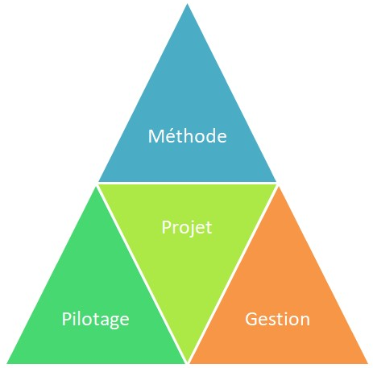

# Gestion de projets

## Définition des étapes

### Etapes en amont

#### Le découpage du projet

Faire un découpage du projet en étapes, de manière appropriée :
* Trop simple : risque d’oubli d’éléments importants
* Trop détaillé : ingérable / perte de temps

#### Les objectifs du projet

Mêmes caractéristiques que les indicateurs : SMART
* Spécifique
* Mesurable
* Atteignable
* Réaliste
* Temporel

#### Le périmètre du projet

* Précis
* En fonction des autres projets en cours et à venir
* Eviter les redondances
* Réaliste 

#### Définition des livrables

Un livrable est tout résultat, document, mesurable, tangible ou vérifiable, qui résulte de l’achèvement d’une partie du projet ou du projet (cahier des charges, document, support de formation, outil total ou partie, ...)
* Conformes aux objectifs
* Définis précisément
* Selon commanditaires et utilisateurs
* Délai de livraison identifié

#### Analyse de la complexité - Maîtriser les risques

Projet = prise de risques = monde d’incertitudes => Gestion des risques
* Identification des risques : cartographie
* Priorisation
* Actions préventives
* Evaluation
* Evolutif et dynamique durant la durée de vie du projet 

Identifier les risques = facteurs d’échec du projet
* Par rapport aux objectifs du projet
* Validés
* Partagés par les acteurs

Risques multi domaines:
* Stratégique : pas engagement direction, absence de ressources, pas de budget, opposants (cf. stratégie des alliés) …
* Management: démotivation, désorganisation équipe
* Technique
* Ressources externes: sous traitants, délais, malfaçon
* Financier
* Marketing: solution finale non adaptée au client
* Juridique

## Actions à mener

### Liste des tâches

Action => résultat

Caractérisé par :
* Un objectif précis et mesurable
* Des ressources humaines, matérielles et financières adaptées
* Une charge de travail (exprimée en nombre de jour/homme)
* Une durée, assez courte (< ou = à 15 jours)
* Une date de début, une date de fin 

## Les outils

* Analyse fonctionnelle
* "Todo list", tâches à faire
* Diagramme PERT : interdépendance des tâches
* Réseau des antécédents 

### Analyse fonctionnelle

#### Principe – Objectif

Structurer le projet
Répartir le projet (technique et humains) en lots et sous lots
Utilisation cadre gestion des projets :
* Projet
* Activités
* Tâches
* Sous tâches 

#### Description des tâches - Approche processus

Un input (produit en entrée) : souvent livrable tâche précédente
Un output (produit en sortie) : livrable
Une durée : date de début et de fin
Des acteurs: pilote, réalisation
Une charge de travail : j / homme
Des ressources nécessaires

#### Identification et inter dépendance des tâches

Séquence chronologique
Dépendance des tâches
Estimation de la durée
Estimation des charges de travail

#### Estimation des charges de travail

Par activité et tâche
Charge de travail non corrélée forcément à la durée des tâches
Répartir la charge entre les acteurs du projet selon la matrice "RACI"
* R = Réalise
* A = Approuve (valide et se porte garant)
* C = est Consulté (avant)
* I = est Informé (après)

#### RACI

Chaque tâche doit avoir à minima un pilote et un acteur réalisation 

| Domaine | Tâche | Acteur 1 | Acteur 2 | Acteur 3 | Acteur 4 |
| ------- | ----- | -------- | -------- | -------- | -------- |
|Gestion des risques|Suivre les non conformités et les analyser | I | A | R | |
|Audits|Réaliser les audits| I | A | R | |
|Pilotage|Réaliser les revues de direction|A|R | |

#### Nivellement par les charges

Valeur globale = durée x intensité
Selon les tâches :
Nivellement possible :
1 semaine à 100 % = 2 semaines à 50 %
La charge reste la même
Nivellement impossible : tâches à « durée fixe » 

### Todo list

#### Principe – Objectif

Elaborer la liste et la répartition des tâches
Utilisation cadre gestion des projets
Niveau de difficulté d’emploi : facile
Quand :
* En phase de lancement
* Actualisée au cours du déploiement

Comment :
* "Fil rouge / check list" vérifié lors des réunions équipe projet
* Combinaison possible avec PERT et réseau des antécédents

#### Présentation

|Objectif|Tâche|Pilote ou « RACI »|Date de début prévue ou effective|Date de réalisation attendue ou réelle|Suivi|Niveau alerte|
|Objectif 1|Tâche 1|Mr X|15/1/2014|30/3/2014|Déroulement conforme au 04/03/14| |
|P |Tâche 2|Mme Y|15/1/2014|30/12/2014|Pas commencé au 04/03/14| |
|Objectif 2|Tache 1|Mr X|1/3/2014|15/03/2014|Achevé le 10/03/14 | |

#### Choix des acteurs

Maître d’ouvrage = acheteur du produit du projet ; il assume l’orientation du projet.
Maître d’oeuvre = personne engagée, vis-à-vis du maître d’ouvrage, sur le bon achèvement du projet.
Chef de projet = personne chargée, par le maître d’oeuvre, du bon achèvement du projet avec les ressources qui lui sont affectées

Par rapport aux besoins évalués :
* Client Commanditaire / Utilisateur
* Prise de décision Direction(s), commanditaires
* Pilotage Chef de projet, coordonnateur
* Réalisation Equipe projet (multidisciplinaire) - Partenaires
* Utilisation Utilisateurs finaux

#### Nomination du chef de projet – pilote

* Responsabilité du déroulement du projet
* Conduite du projet
* Valide et met en œuvre les plans d’action
* Veille au respect du calendrier et du budget
* Manage l’équipe projet
* Communique tant en interne qu’en externe
* Compétence technique, managériale, négociation, communication et … gestion de projet 

#### Constitution de l’équipe projet

Durée de vie limitée = durée du projet
Nombre limité de personnes
Multi disciplinaire, multi professionnelle : compétences et visions
complémentaires
Transversalité ; Fonctionnement hors hiérarchie (sauf // pilote)
Esprit, objectifs, démarche communs
Pas de conflits d’intérêt
Solidairement responsables
Expertises
Techniques
Fonctionnelles
Disponibles !

#### Types de réunions au cours des projets

Réunion de lancement
Réunion pilotage
Avec commanditaires et pilotes
Point ponctuel ; analyse des écarts
Réunion groupe projet
ensemble équipe projet
point régulier (hebdomadaire)
suivi du déroulement, point problématiques rencontrées
Réunion technique
certains membres équipe projet
experts de la problématique
Réunion communication

#### Calendrier de GANTT

Echelle globale de temps
Représentation graphique et temporelle des phases, tâches, ressources …
Lignes = tâches
Colonne = temps
Avantages :
Très simple
Pas besoin d’outil spécifique
Limite :
Interrelations entre les tâches pas / peu visibles

### Etapes de réalisation

Réalisation du projet
Engagement de la direction
Formalisé
Déploiement
Selon planning
Suivi
En continu, par pilote & équipe projet
Validation des livrables
Evaluation
Régulier, selon le planning
Retour vers commanditaires et utilisateurs
Adaptation si besoin du projet

### Etapes transversales

Gestion des ressources
§ Humaines
§ Matérielles
§ Financières
Etapes transversales
Gestion du budget
§ Estimation initiale
§ Dépenses engagées ; par tâche, cumulé
§ Poursuivre et finir le projet
§ Responsabilité // financeur
Communication
§ Plan de communication initial
§ Lancement ; Nom du projet ; Logo
§ Etapes intermédiaires
§ Transparence
§ Valorisation du projet
§ Rassurer les utilisateurs 

Suivi du projet – Pilotage
Analyse des écarts
Ne pas rechercher de bouc émissaire
Comprendre les causes
Objectifs : trop nombreux ? mal définis ?
Ressources (humaines, matérielles, financières)
situations possibles d’indisponibilité ?
Temps : suffisant ?
Compétences : suffisantes ?
Outils : adaptés ?
Suivi : suffisant ?
Motivation des équipes : soutenue ?

### Etapes post-projet

Clôture du projet
§ Bilan // attendu
Atteinte des objectifs
Livrables obtenus
Ressources engagées
Budget
Satisfaction des utilisateurs
…
§ Débriefing avec l’équipe projet ; remerciements
§ Dégager un retour d’expérience ; capitaliser au
niveau de l’équipe et institutionnellement 

## Synthèse

|Les	étapes|Les	objectifs|Les	outils	|
|Périmètre	du	projet|Défini4on	des	livrables|Analyse	fonc4onnelle	|
|Ges4on	des	risques|Prévenir	et	surveiller|SWOT	;	AMDEC	|
|Préciser|Défini4on	des	étapes|Todo list|
|Iden4fier	les	acteurs|Liste	des	tâches	avec	responsabilité,	coordina4on	|Matrice	RACI	|
|Planifier|Durée	et	ordre	des	tâches|PERT	|
|Ressources| Iden4fier	les	ressources	nécessaires	et	disponibles|PERT	|
|Calendrier| Définir	dans	le	temps	Piloter;	repor4ng|GanT	|
|Suivi	financier|	 Gérer	le	budget|	 Courbes	en	S|

### Les points clés de réussite de la gestion de projet

Méthodes :
Méthode
Objectif
Rigueur
Risques
Fin
Début 

Gestion :
Equipe
Epanouissement
Communication
Adhésion
Reconnaissance
Motivation 

Pilotage :
Organisation
Évaluation
Prise de décision
Coordination
Arbitrage
Bilan 

### Les causes d’échecs de la gestion de projet

Méthodes :
Incohérence de stratégie
Objectifs flous
Livrables mal ou non identifiés
Pas de formulation des risques
Manque de ressources
Estimations fausses
Pas d’échéance
Pas de suivi 

Gestion :
Absence de langage commun
Faible disponibilité
Manque de motivation
Défaut de compétences
Pas de reconnaissance 

Pilotage :
Pas d’esprit d’équipe
Jeux d’influence
Pas de meneur
Pas de décideur
Trop de décideurs